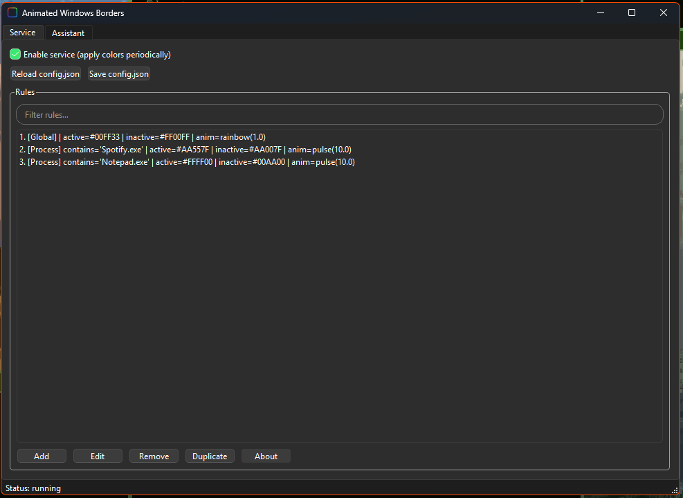

# Animated Windows Borders


A utility built with **Python + PySide6** that colors the **Windows window borders** using DWM.
You define rules by **Global** or by **Process**, choose active/inactive colors, and optionally enable animations.

The app runs in the background with a system tray icon and stores settings in a JSON file.

---

## ✨ Features

- **Rule system:** `Global` applies to every window; `Process` targets a specific executable. Process rules take precedence.
- **Editable colors:** pick active/inactive border colors per rule (`#RRGGBB`, `default`, `none`).
- **Animations:** built-in `rainbow`, `pulse`, `fade`, plus optional `breath`, `tri`, `sparkle`, `steps`.
- **Color-aware animations:** `pulse`, `fade`, `breath`, `tri`, `sparkle`, `steps` interpolate using each rule’s **active ↔ inactive** colors.
- **Global sync:** when an animation is enabled on the **Global** rule, all affected windows animate **in perfect sync** (same phase and color), including windows opened later.
- **Differential DWM updates:** avoids redundant `DwmSetWindowAttribute` calls for performance.
- **Tray and background mode:** the window close button sends the app to the tray; exit from the tray menu.
- **Single instance:** prevents launching a second instance (uses a file lock).
- **Config persistence:** JSON config with atomic saves and reload.
- **Assistant tab:** quickly create rules from running processes or open windows.

---

## 📦 Installation

### Option 1: Using the executable (.exe)

1. [Download the executable from the Releases section](https://github.com/jrcn1991/app_animated_window_borders/releases/latest).
2. Place it anywhere.
3. Double-click to start.
4. To auto-start with Windows, use the Startup folder or Task Scheduler.

### Option 2: Running from source (Python)

1. Install **Python 3.9+** on Windows.
2. Install dependencies:
   ```bash
   pip install PySide6 psutil pywin32
   ```
3. Run:
   ```bash
   python main.py
   ```

---

## 🚀 Structure and Usage

### 1. Service tab
- **Enable service** turns on the periodic application of colors.
- **Reload config.json / Save config.json** manage the JSON on disk.
- **Rules** panel lists every rule and exposes **Add / Edit / Remove / Duplicate** and a filter box.

### 2. Rule fields

| Field | Description |
|---|---|
| **Match type** | `Global` or `Process`. Global matches all windows; Process matches by executable name (case-insensitive). |
| **Parameter (contains)** | For `Process` rules: a substring of the process name, e.g., `Spotify.exe`. Leave empty for Global. |
| **Active color** | `#RRGGBB`, `default`, or `none`. Applied to the foreground window when not animating. |
| **Inactive color** | `#RRGGBB`, `default`, or `none`. Applied to background windows when not animating. |
| **Animation** | Type: `none`, `rainbow`, `pulse`, `fade`, `breath`, `tri`, `sparkle`, `steps`. Speed: 0.1 to 10.0. When enabled, animation overrides static colors. |

#### Practical JSON examples

- **Global (static colors):**
  ```json
  {
    "match": "Global",
    "active_border_color": "#C6A0F6",
    "inactive_border_color": "#FFFFFF",
    "animation": { "type": "none", "speed": 1.0 }
  }
  ```
- **Process (animated):**
  ```json
  {
    "match": "Process",
    "contains": "Spotify.exe",
    "active_border_color": "#FF0000",
    "inactive_border_color": "#0000FF",
    "animation": { "type": "pulse", "speed": 1.0 }
  }
  ```

> Notes:
> - Animations that use two colors (`pulse`, `fade`, `tri`, `steps`) blend **active ↔ inactive**.
> - Single-color effects (`breath`, `sparkle`) vary around the **active** color.
> - The **Global sync** mechanism advances time only once per update cycle and uses a shared animation key for Global rules, keeping all affected windows synchronized.

---

### 3. Main buttons and actions
- **Enable service** → start periodic updates.
- **Reload / Save config.json** → load or persist settings atomically.
- **Add / Edit / Remove / Duplicate** → manage rules; the Global rule is always present and pinned at the top.
- **Assistant tab:** refresh lists, and create a rule from a selected process or window.

---

## 🖼️ Interface and Demonstrations

### Main screen
  

### Real-time operation
  

### About animations
- `rainbow` cycles colors by itself.
- `pulse` and `fade` produce smooth two-color transitions.
- `breath` softly brightens and returns to the active color.
- `tri` ping-pongs linearly; `steps` changes in discrete levels; `sparkle` adds subtle shimmer.
- Updates are timer-driven and only touch visible, non-tool windows.

---

## 🔍 How rule matching works

1. The **Global** rule always exists and sits at index 0 to provide defaults.
2. **Process** rules match when `contains` is found in the window’s executable name (case-insensitive).
3. When multiple rules match, **Process** wins over Global.

---

## 🛠️ Tips and Troubleshooting

- **No border change** → ensure the service is enabled and the window is visible and not a tool window (hidden/tool windows are skipped).
- **Edits aren’t reflected** → click **Save config.json**, then **Reload** if you edited the file outside the app.
- **Heavy CPU** → animations use coarse timers and differential updates to reduce load. Lower animation speed if needed.
- **Quick rule creation** → use the **Assistant** tab to pull from current processes/windows.

---

## ⚠️ Requirements

- Windows 10 or 11.
- Python 3.9+ (when running from source).
- Dependencies: PySide6, psutil, pywin32.

---

## 👨‍💻 Author

**Rafael Neves**  
🌐 [rafaelneves.dev.br](https://rafaelneves.dev.br)  


---

## 📜 License

Distributed under the **MIT** license.
Free to use, modify, and share.
